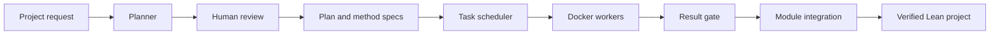
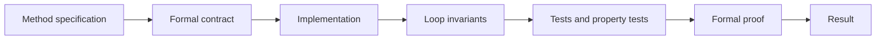
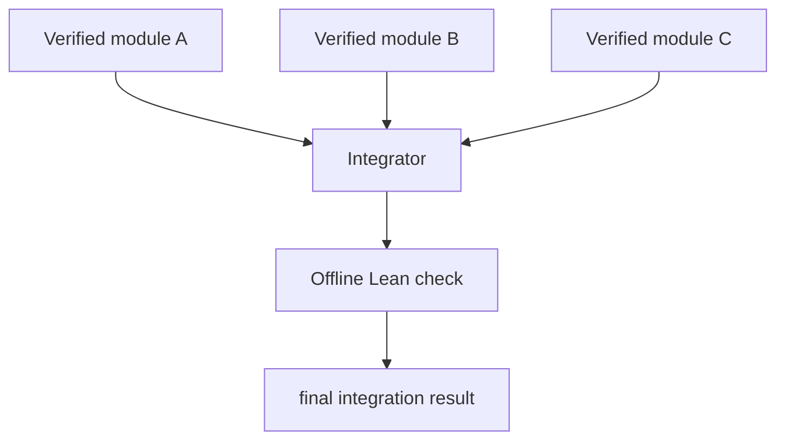

# Multi agent progress

LeetProof can now turn a natural language project request into a set of independently verified Lean modules. The system plans the work, gives the user
a review step, runs isolated docker workers (each with the stripped down leetproof engine), checks their results, and verifies that the final modules compile together.

## Architecture

The planner reads a short project description and divides it into single-method tasks. It writes a `plan.json` file and one natural language specification for each method. Nothing runs until the user reviews these files.

The plan also records task dependencies. The scheduler uses them to decide which tasks can run at the same time and which tasks must wait.

## Worker pipeline

Each task runs inside its own Docker container. The worker receives one method specification and writes to a separate run directory.

The formal contract is saved separately and hashed before implementation. This prevents a later stage from weakening the contract to make the proof easier.

The worker generates an implementation, concrete tests, property tests, loop invariants, and a formal proof. Its result file records the contract hash, implementation hash, test status, proof status, and the outcome of every pipeline stage.

## Result validation

The result gate accepts a worker only when its tests, property tests, and proof pass. It checks the recorded hashes against the actual files and rejects Lean code containing `sorry` or `admit`.

If a task fails, its run directory is kept for inspection. Tasks that depend on it are not started.

## Integration

Accepted modules are copied into a clean integration directory. Each module is placed in a namespace such as `Generated.FilterAliveNodes`. This prevents common names such as `precondition` and `postcondition` from colliding.

The integrator recompiles the modules and their proofs with networking disabled. The source hashes and integrated module hashes are written to `integration_result.json`.

Property tests are not repeated in the namespaced copy. They have already passed against the immutable worker artifact. Formal proofs and combined imports are checked again during integration.

## Current issues

- Verification of the invariant for a particualr domain is still hard. We always nseed domain expertise.
- The breaking of the initial natual language spec into further chunks to be verified by the the reviewer still provides bottleneck along with the dependency graph for how it will be picked up by the workers and implemented.
- The integrator still just accumulates the entire output from the workers rather than working as a glue layer. Solving for that glue is critial.
- It would be great if we can extend to it handle both liveness and readiness properties like TLA. My focus is to use it on large distributed systems (as a start) and that requires both these properties. I know you folks have been working on veil and I'm interesed in how we can use that here.
